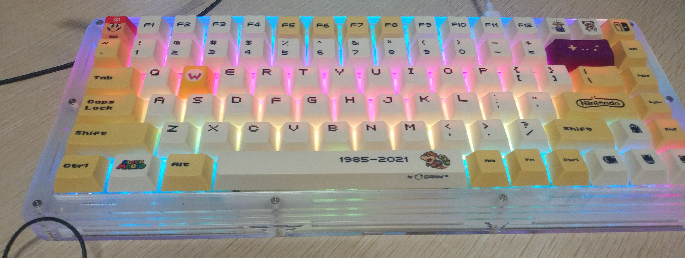
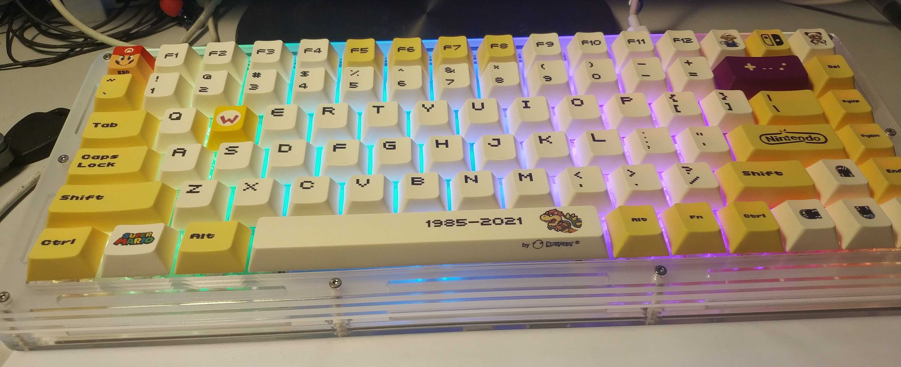
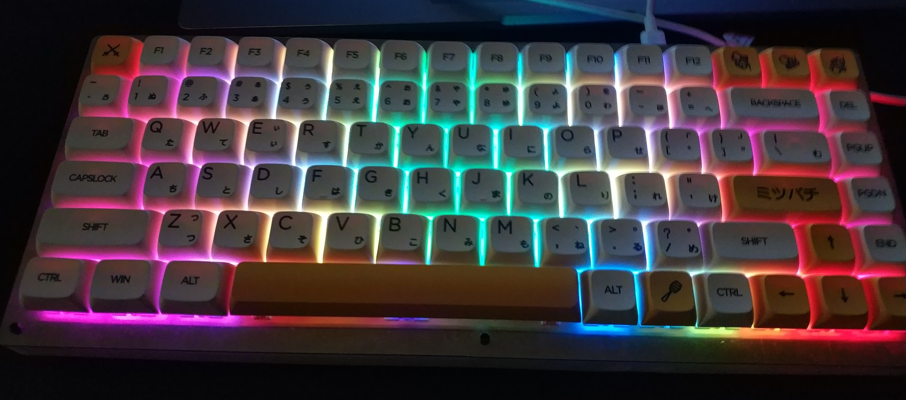
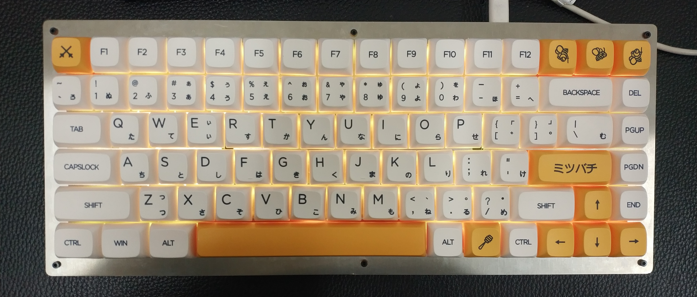
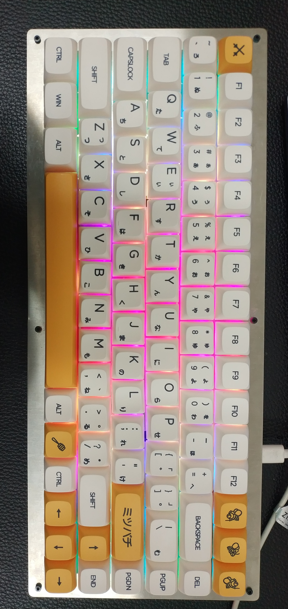
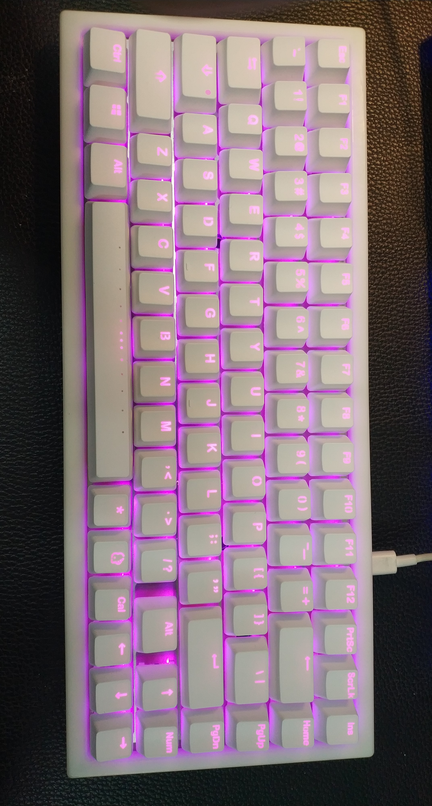

# Anton

Anton is a custom keyboard project.

All what you need to build a keyboard is/will be in this repo.

## Details

Anton is a comtom design keyboard, it is based on STM32F103C8T6 MCU and QMK firmware. In this repo, all files(PCB, mechanical structure and code) are included.All what you need to do to make a same keyboard is clone all this files and make all things by taobao.com. 

# Features

- WS2812 RGB Lighting
- ~~Bluetooth(TODO)~~

# 2022-10-29 EDIT

After 4 keyboards made out this design and 2 years of use, I hereby announce this project a success.

# License

GPL